# 2DInternetProvider
 
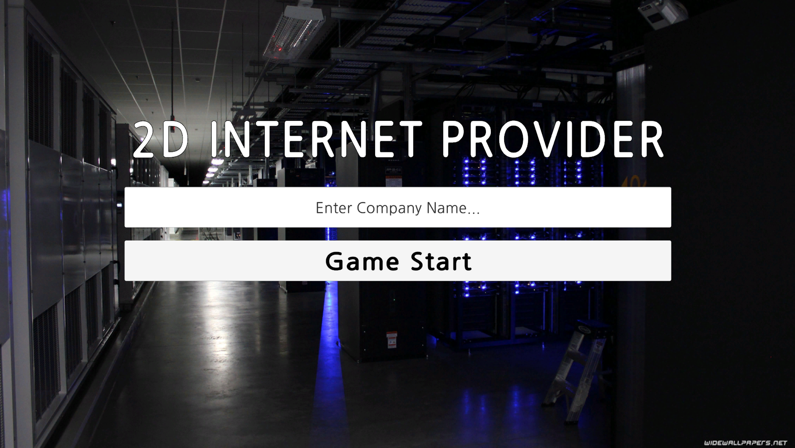
### 2D Internet Provider에 오신것을 환영합니다.
위의 사진은 게임의 타이틀 화면입니다. 
여기서 회사의 이름을 입력한 뒤 아래의 Game Start 버튼을 누르면 게임에 진입합니다. 
회사명은 영어, 한글, 숫자, 띄어쓰기가 가능합니다. [a-zA-Z0-9가-힣 ]

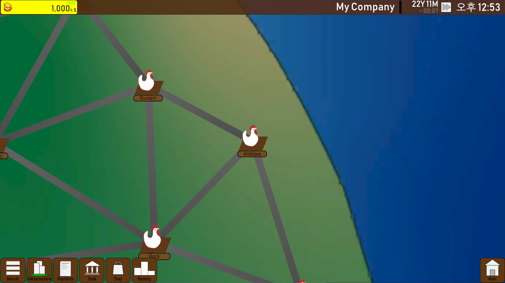
### World Map 화면입니다.
게임을 시작하면 다음과 같은 월드맵 화면에서 시작합니다. 
저의 시작도시는 Andosea이기 때문에 화면 중앙에 이 도시가 존재하지만, 여러분들은 저와 같은 혹은 다른 도시에서 시작하게 되실 겁니다. 
좌측 상단의 1000은 현재 가지고있는 자금을 나타냅니다.  
그 위에 작게 초록색으로 숫자가 있는데요, 초록색은 월 순이익, 빨간색은 월 순손실을 의미합니다. 
늘 초록색 숫자여야 흑자로 운영하고 있다는 의미겠죠? 

우측 상단에는 회사의 이름과 게임 내 시간, 현실 시간, 그리고 버튼 하나가 있습니다. 
게임 내 시간은 1달 단위로, 10분에 1달씩 지나갑니다. 
만약 내가 이것저것 할 일이 많다면 모르겠지만, 할 일이 없다면 10분은 너무나 긴 시간일 것입니다. 
이를 위해 게임 시간 오른쪽에 빨리감기 느낌의 버튼이 있습니다. 이 버튼을 누르면 다음달로 바로 넘어가집니다. 

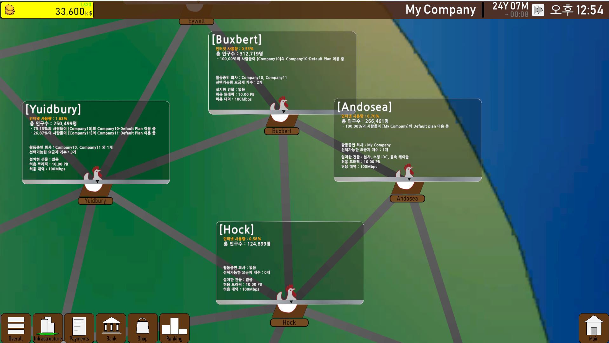
### 도시 정보 화면입니다.
월드맵에 보이는 도시 이미지를 클릭하면 
해당 도시의 이름, 인구수, 인터넷 활용률, 선택된 요금제 종류 등이 표시됩니다. 
이를 바탕으로 우리는 더 큰 영업이익을 위한 도시를 선택하며 영업해나가야합니다. 
 
월드맵에는 두 종류의 도시가 있습니다. 
첫번째로는 위에서 많이 보이는 닭 그림이 그려진 도시입니다. 이 도시는 시골이라는 의미로 1만명~50만명 사이의 인구를 갖습니다. 
지도에서 보이지는 않지만 두번째 종류로 빌딩들이 그려진(빌딩으로 보이지 않을수도 있지만) 도시가 있습니다. 
이 도시는 큰 도시라는 의미로 100만명에서 500만명 사이의 인구를 갖습니다. 
도시의 인구수와 인터넷 활용률에 따라 도시별 트래픽량이 달라지므로, 요금제를 서비스할때 주의해야합니다. 
그렇다면 어떻게 다른 도시로 영업할까요? 

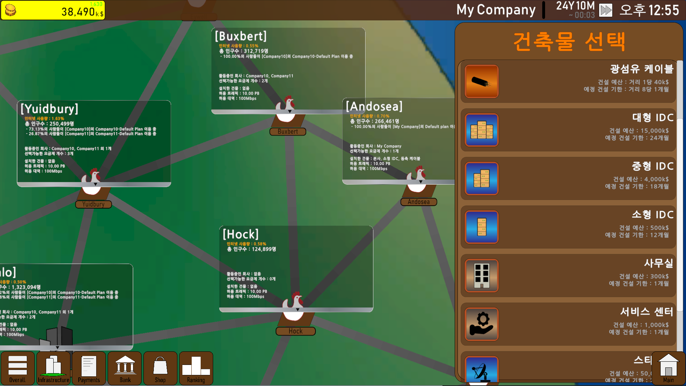
### 건물 건설 화면입니다.
화면 왼쪽 아래에 있는 버튼 중 빌딩모양 아이콘이 그려진 Infrastructure 버튼을 누르면 위 사진과 같이 건설가능한 목록이 나옵니다. 
다른 도시로 영업을 하기 위해서는 먼저 그 도시에 사무실(Office)를 건설하고, 전선(Cable)을 연결해야합니다. 
월드맵을 보시면 도시들 사이에 회색 선이 연결된 모습을 보실 수 있습니다. 이게 전선을 설치할 수 있는 길입니다. 
사무실을 건설하려고 하면, 이미 사무실이 있는 도시와 연결된 다른 도시들 중에서 건설 할 수 있고, 
전선도 사무실이 있는 도시에서 다른 사무실이 있는 도시로 연결할 수 있습니다. 
 
건물 목록은 다음과 같습니다. 

이름 | 건설비용 | 건설 기간 | 유지비용 | 선행 조건 | 효과
:---:|:---:|:---:|:---:|:---:|:---:
|사무실| 300k$ | 1달 | 300k$ | 연결| 전선 연결 가능
|동축케이블| 거리에 비례 | 거리에 비례 | 1k$ | 사무실 설치 | 해당 도시 인터넷 속도 100Mbps↑
|지중동축케이블| 거리에 비례 | 거리에 비례 | 2.5k$ | 사무실 설치 | 해당 도시 인터넷 속도 300Mbps↑
|광섬유케이블| 거리에 비례 | 거리에 비례 | 5k$ | 사무실 설치 | 해당 도시 인터넷 속도 600Mbps↑
|지중광섬유케이블| 거리에 비례 | 거리에 비례 | 6.5k$ | 사무실 설치 | 해당 도시 인터넷 속도 1Gbps↑
|소형 IDC| 500k$ | 12개월 | 500k$ | 전선이 연결 | 전체 트래픽 10PB↑
|중형 IDC| 4000$ | 18개월 | 6000k$ | 전선이 연결 | 전체 트래픽 200PB↑
|대형 IDC| 20000k$ | 24개월 | 20000k$ | 전선이 연결 | 전체 트래픽 10EB↑
|캐시 서버| 5000k$ | 9개월 | 3000k$ | IDC 설치 | 해당 도시 인터넷 속도 1Gbps↑ 
|스타링크| 50000k$ | 24개월 | 150000k$ | 대형 IDC와 캐시서버가 설치 | 모든 도시에 10Gbps↑

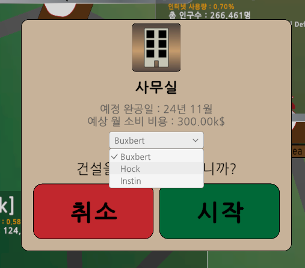
### 건설 확인 화면입니다.
건물 건설 화면에서 건축물을 선택하면 다음과 같은 팝업이 나타납니다. 
여기서 설치할 도시를 선택하고, 예정 완공일과 예상 월 소비비용을 확인한 후 시작을 누르면 됩니다. 
저는 Hock에 사무실을 설치해보겠습니다. 
완성되면 아래와 같이 도시 정보에 사무실이 추가된 것을 볼 수 있습니다.

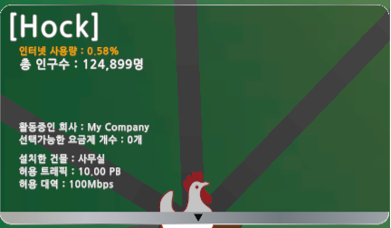

운이 안좋다면 시작도시에 따라 적은 순이익 혹은 적자로 시작할 수 있습니다.  
이 경우 은행을 통해 대출을 받을 수 있습니다.  
화면 좌측 하단의 Bank 버튼을 누르면 은행 화면으로 이동합니다.  

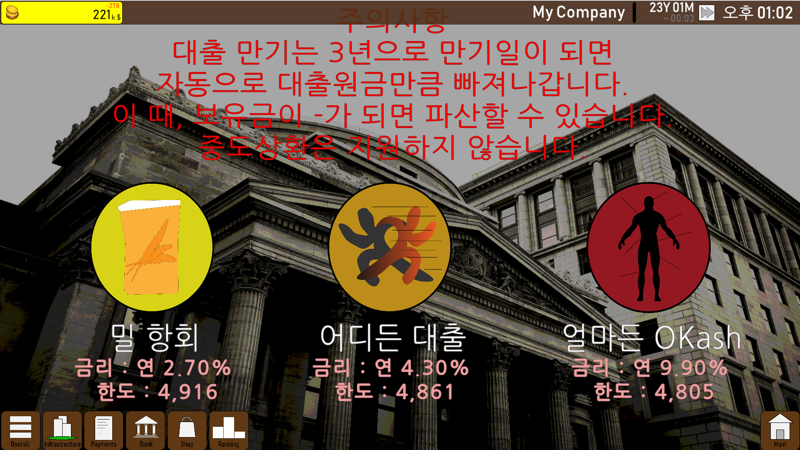
### 은행 화면입니다.
은행들은 회사가 12개월간 창출한 순이익/순손실금의 평균값을 토대로 대출한도를 결정합니다. 
만약 이전 12개월동안 쭉 흑자를 봐왔다면 한도가 더 높아질 것이고, 적자를 봤다면 낮아질 것입니다. 
그렇기 때문에 불운하게 적자로 시작했다면, 최대한 빨리 대출을 받아야 할 것입니다. 
 
은행은 3가지 은행이 제공됩니다. 사진에서 볼 수 있듯 '밀 항회' '어디든 대출' '얼마든 OKash'입니다. 
'밀 항회'는 1금융권입니다. 낮은 금리로 제공하는 만큼, 12개월 평균의 30%만 반영합니다. 
'어디든 대출'은 2금융권입니다. 중간 정도의 금리로 제공하며, 12개월 평균의 50%를 반영합니다. 
'얼마든 OKash'는 3금융권입니다. 높은 금리로 제공하며, 12개월 평균 70%를 반영합니다. 
 
은행 이미지를 클릭하면 다음과 같은 대출 화면이 나타납니다. 
대출을 받는 방법은 간단하게, 중앙 텍스트박스에 원하는 금액을 한도이하로 입력하고 대출받으면됩니다. 
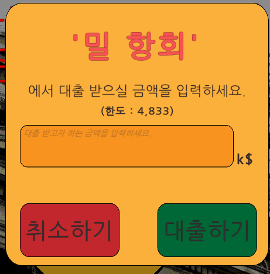
 
은행 대출은 중도상환이 없습니다. 
대출은 36개월간 지속되며, 월마다 이자만큼 자동으로 인출되고, 36개월 후에 원금이 한번에 빠집니다. 
만약 대출금이 강제로 상환되면서 보유금이 0미만으로 떨어질 경우, 자동 청산될 수 있음을 주의하세요 
 

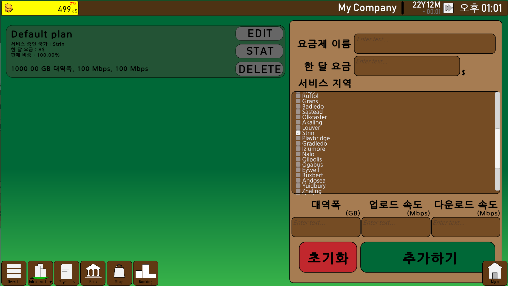
### 요금제 설정 화면입니다.
건물을 짓고 도시로 나갔다면 영업을 해야겠죠. 
이 화면은 왼쪽 아래의 Plan버튼을 누르면 올 수 있습니다. 
여기서는 각 요금제가 어느 정도의 트래픽과 속도를 보장하고, 어떤 도시에서만 운영할지 결정할 수 있습니다. 
또한, 기존 요금제의 EDIT버튼을 눌러 수정하거나, DELETE버튼을 눌러 요금제를 삭제할 수 있습니다. 
좌측의 요금제 정보에는 전체 수익중 어느 정도의 비중을 차지하는지 나타내는 판매비중을 포함한 요금제의 정보들이 표시됩니다. 
 
요금제를 만드는 법은 간단합니다. 우측에 있는 UI에 모든 텍스트를 입력하고 추가하기를 누르면됩니다. 
수정할때도 EDIT버튼을 누르면 해당 요금제의 정보가 우측 UI에 복사될텐데 이를 수정하고 추가하기를 누르면 적용됩니다. 
 
요금제 제작에서 주의할 점은 허용 트래픽입니다. 
게임을 시작할 때 우리는 시작 도시에 소형 IDC를 지급받기 때문에 회사의 전체 트래픽은 10PB(= 10,000,000GB)입니다. 
그러면 우리는 10PB까지의 요금제를 만들 수 있는가? 아닙니다. 
요금제가 선택되면, 해당 요금제를 선택한 사람수 * 그 도시의 인터넷 사용량 만큼이 트래픽으로 사용됩니다. 
만약 인터넷 사용량이 1%인 도시에서 10만명이 내 1000GB대역 요금제를 사용한다면, 
1000GB * 100,000명 * 0.01 = 1,000,000GB(=1PB)의 트래픽을 사용하는 것입니다. 
 
만약 회사가 감당할 수 있는 트래픽이나 대역(속도)보다 높은 요금제를 만들고, 그 요금제가 서비스된다면 
보장한 속도를 낼 수 없기 때문에 회사의 신뢰도가 떨어지고, 
신뢰도가 떨어진다면 다른 회사보다 실제 성능이 좋은 요금제도 잘 안팔리게 될 것입니다. 
양심적인 장사가 중요하겠죠? 
 

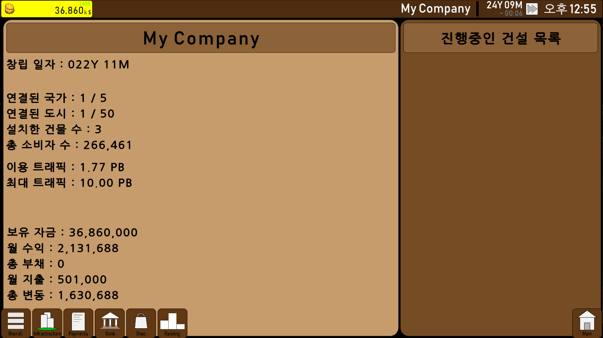
### Overall 화면입니다.
여기서는 회사의 이름, 시작한 날짜, 수익금과 매달 사용하는 비용, 건설중인 건물 등의 정보가 표시됩니다. 
만약 제가 대형 IDC를 건설하고 있다면 아래 이미지와 같이 오른쪽에 표시됩니다. 

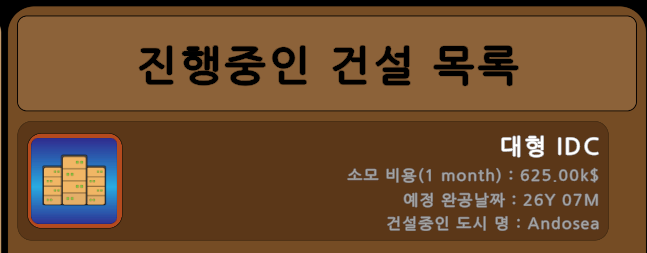
 

만약 AI 회사들과 자신의 차이를 알아보고 싶다면, Rank 버튼을 눌러보면됩니다. 

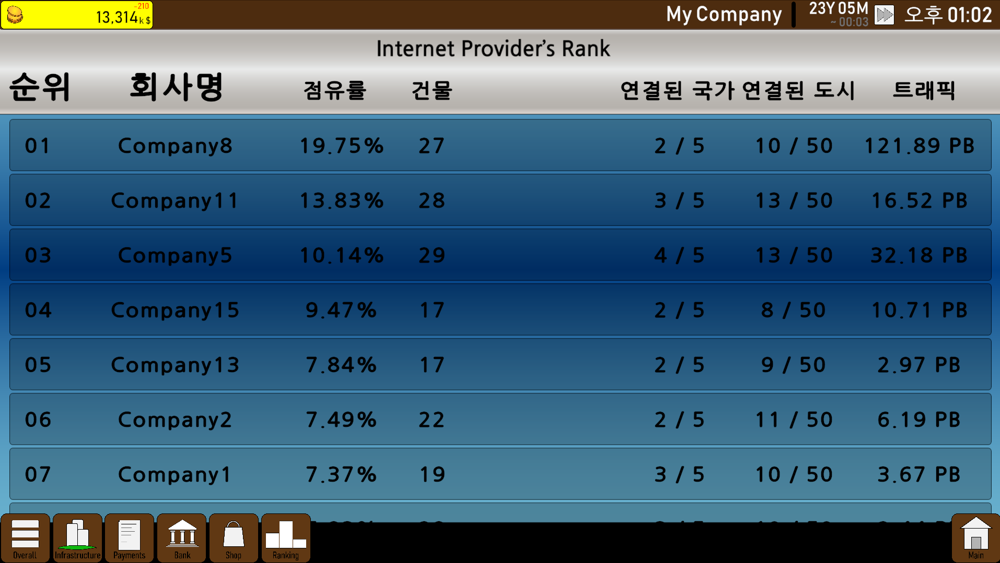
### 랭킹 화면입니다.
해당 화면에는 AI회사 15개와 유저 회사 1개, 총 16개의 회사들의 순위를 보여줍니다. 
여기서 점유율이란, 게임 도시에 존재하는 총 인구수 중 몇 퍼센트의 사람들에게 자신의 요금제를 서비스하는가? 입니다. 
1등 회사인 Comapny 8은 10개의 도시에서 총 인구수 약 20%만큼에게 서비스를 하면서 트래픽량이 193PB인걸 볼 수 있습니다. 
만약 인터넷 사용률은 낮고 인구는 많은 도시에서 많은 서비스를 한다면 점유율은 높고 트래픽은 낮게 나오기 때문에 
트래픽량과 점유율은 일정하게 비례하지는 않습니다. 
그러나 수익금은 인구수와 비례하므로, 우리는 점유율에 더 초점을 맞춰서 영업해야 할 것입니다.  
 

너무 영업만하면 피곤하니 인생 역전의 기회도 존재합니다. 
바로 아래에 있는 Shop버튼을 눌러보시죠 

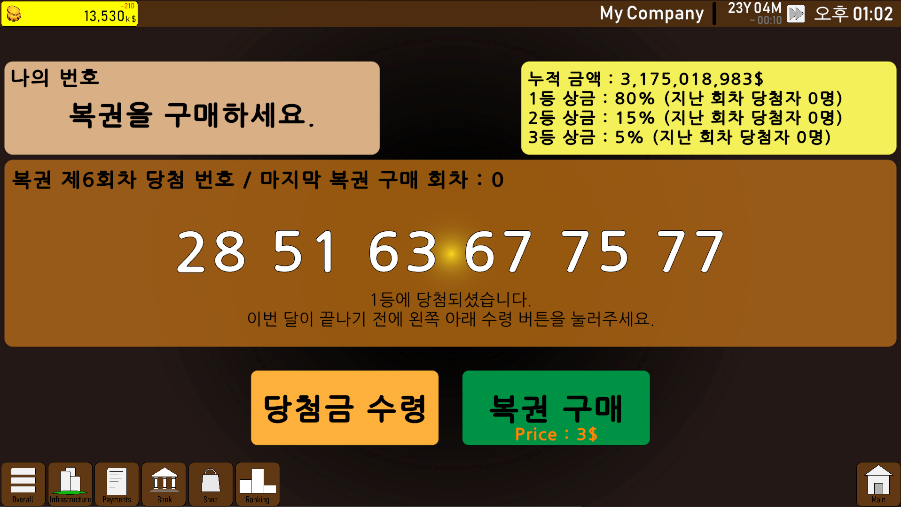
### 상점 화면입니다.
상점이라고 적혀있기 때문에 무엇을 팔 지 궁금해 하실 것입니다. 
이 상점은 복권만 판매합니다. 
모든 도시의 사람들은 인생역전을 꿈꾸므로, 매달 복권을 사지만, 확률이 낮기 때문에 잘 당첨되지는 않습니다. 
그래서 월마다 누적금은 계속 쌓이고 쌓이다가... 당첨이 된다면? 그것을 위해 준비한 복권입니다. 
복권 금액은 저렴하게 3k$입니다. 버튼을 누르면 좌측상단의 내 번호에 아래 이미지와 같이 번호가 등록됩니다. 
 
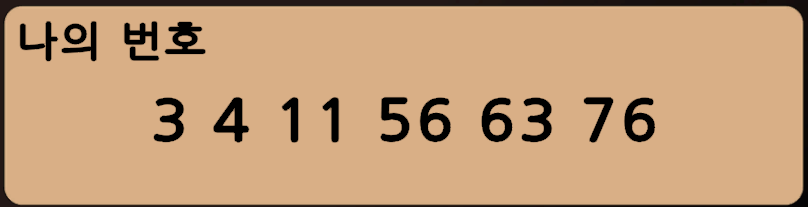
 
첫 화면을 보면 1등에 당첨되었다고 써져있지만, 한 번도 산 적이 없어서 저렇게 나와있을 뿐입니다. 
확률이 처참하기 때문에 당첨이 될지는 알 수 없지만, 저렴한 인생 역전 한방의 꿈을 위해 사보시는건 어떨까요? 
 

### 게임의 승리조건
게임의 승리조건은 다음과 같습니다.
 > 랭킹 1등을 1년간 유지하기

게임의 패배조건은 다음과 같습니다.
 > 신뢰도의 하락으로 인해 아무 도시에서도 요금제를 영업할 수 없는 경우 
 혹은 
 > 보유 자금이 음수인 상태로 3달이 지난 경우

